# 用FocusSearch+ClickHouse打造极致的数据分析速度

## 介绍

### ClickHouse

ClickHouse是分析型数据库的当红炸子鸡，是俄罗斯yandex公司于2016年开源的一个列式数据库管理系统，在OLAP领域像一匹黑马一样，以其超高的性能受到业界的青睐。其使用的shard+replica实现了线性高扩展性和高可靠性，硬件利用率高，多核多节点并行化查询。这些特性让ClickHouse在大数据BI分析的场景下大展身手。

### Focus Search

VizQL时代以来，BI领域新的伟大发明——Focus Search, 第一个中英双文 Text-to-SQL 翻译引擎，适配主流关系型数据库和分析型数据库。它可将用户输入的自然语言转换成SQL语句。

## 痛点及需求

在分析型数据库中，用户通常需要使用SQL语句进行复杂的查询和分析操作。然而，对于不熟悉SQL语法的用户来说，编写准确的SQL语句可能是一项困难的任务。为了降低用户的学习成本和提高工作效率，引入一个自然语言转SQL的解析引擎是非常必要的。

痛点：

1. 不熟悉SQL语法的用户难以编写准确的SQL查询语句。
2. 用户需要额外学习SQL语法，增加学习成本和工作负担。
3. 用户需要花费大量时间和精力来进行SQL语句的调试和优化。

引入FocusSearch（FS）和Clickhouse集成方案能够将自然语言转SQL的解析引擎与Clickhouse数据库进行无缝集成，提供更加便捷和高效的数据分析和查询工具。具体思路如下：

1. 使用FocusSearch作为自然语言转SQL的解析引擎，将用户的自然语言查询语句转换为对Clickhouse数据库的SQL查询语句。
2. FocusSearch和Clickhouse之间建立数据传输通道，保证查询结果的高效传递。
3. 提供用户友好的交互界面，使用户能够直观地使用自然语言查询数据，并获得高质量和准确的查询结果。

通过引入FS+Clickhouse集成方案，可以带来以下价值：

1. 提高用户工作效率：用户无需学习复杂的SQL语法，可以直接使用自然语言进行查询和分析操作，提高工作效率。
2. 降低学习门槛：新用户可以更快地上手使用Clickhouse数据库，减少学习成本，提高用户体验。
3. 减少学习不同数据库方言的麻烦：FocusSearch可支持其他数据库，用户只需学会使用FS即可在不同数据库之间游刃有余。
4. 提供智能的查询建议：FocusSearch可以根据用户的查询意图提供智能的查询建议，帮助用户更好地理解和优化查询语句。
5. 最大限度的释放数据价值。引入FocusSearch之后，可以将数据分析下沉到业务部门，让没有数据库基础的业务精英能直接分析他们的业务数据。

综上所述，引入FS+SS集成方案能够满足用户对自然语言转SQL的需求，并为用户提供更加高效和便捷的数据分析和查询工具。


## 使用方法

### 获取FocusSearch文档

首先进入datafocus.ai官网，免费注册个账户并登录。

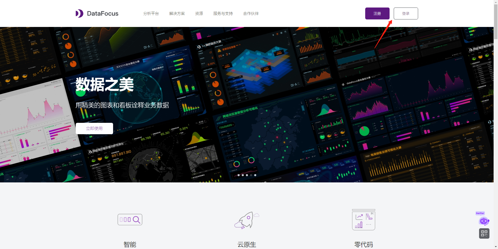


进入控制台页面，点击FocusSearch右上角的“联系我们”，向DataFocus官方申请免费开通FocusSearch。

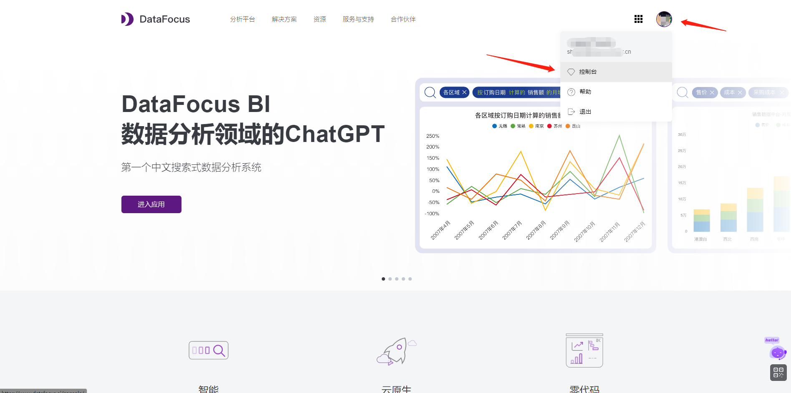

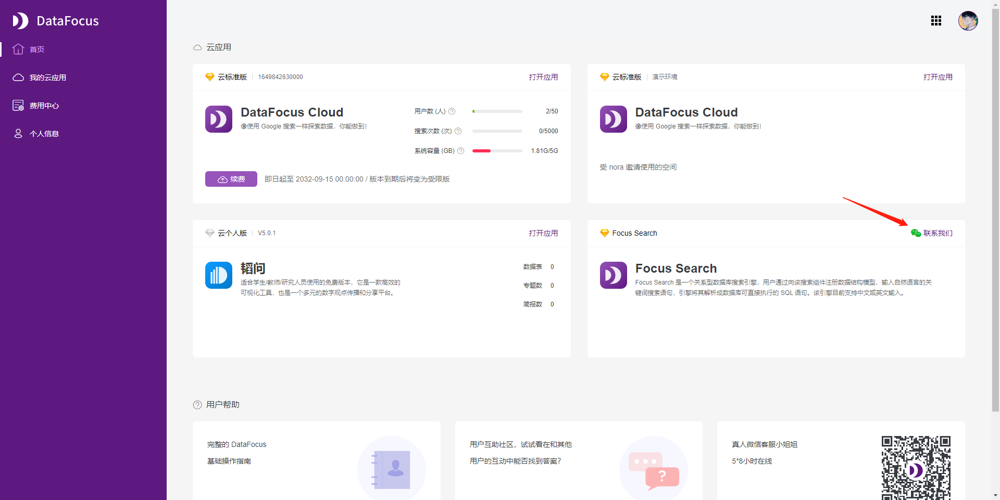

开通成功后刷新页面，FocusSearch右上角变成打开应用，即可获取详细使用文档。

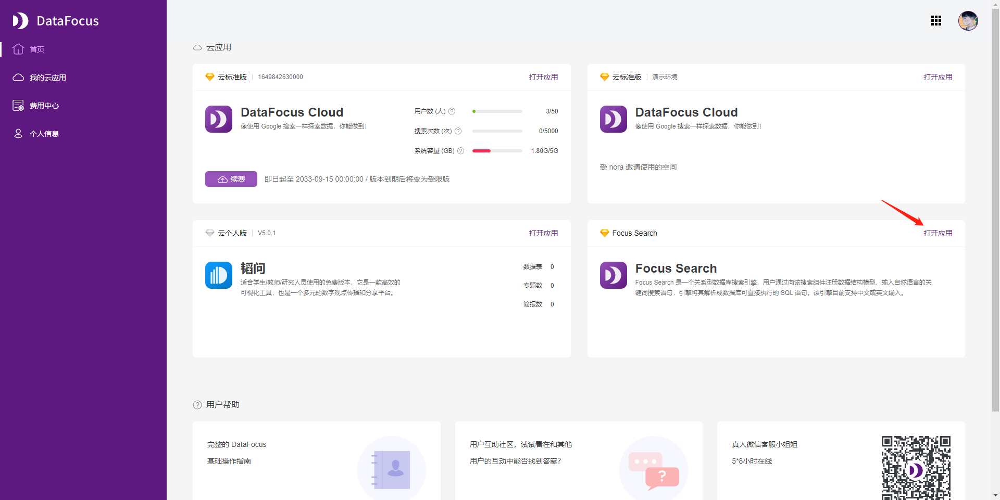


### 获取AKSK和租户ID

在FocusSearch使用指南页顶部切换到“接口权限管理”页面即可获取到Secret Id、Secret Key和Tenant ID，获取这三个信息备用。

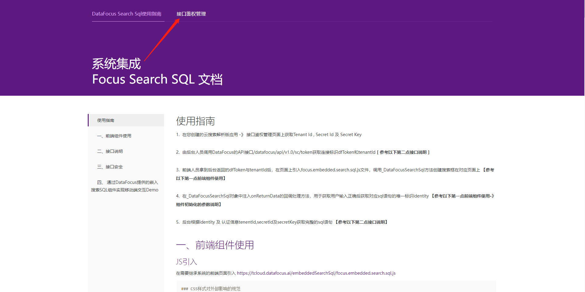

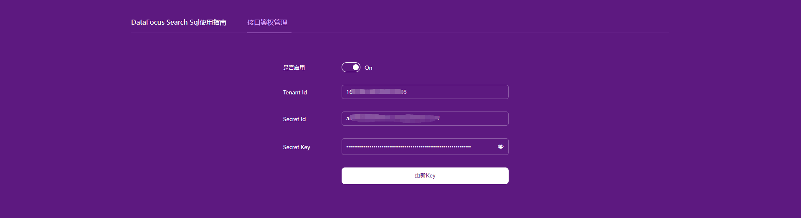

### 代码使用逻辑图

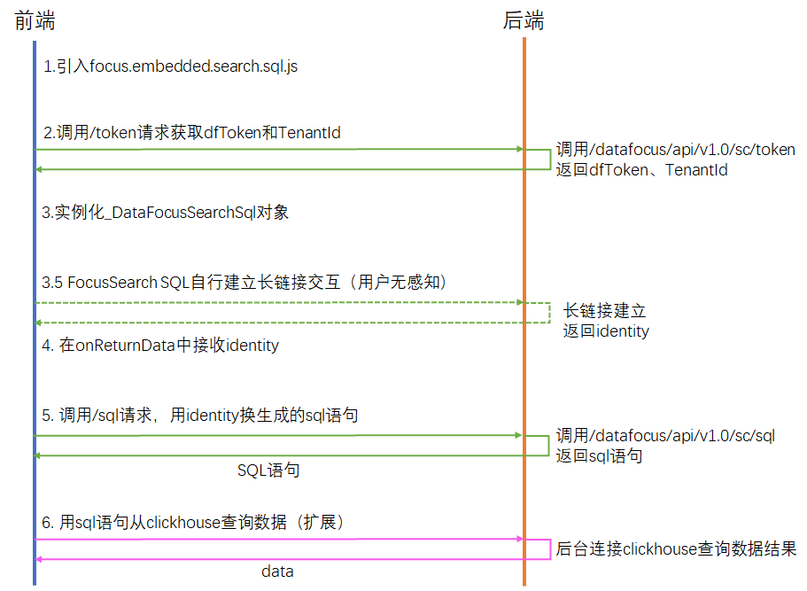


### 后端接口

参考FocusSearch的系统集成使用文档，需要实现两个后端接口。这里使用python的flask+requests简单实现一下。完成两个接口后备用，在下文中前端需要使用到这两个接口。

#### 1. 获取token

````
POST https://cloud.datafocus.ai/datafocus/api/v1.0/sc/token HTTP 1.1
Content-Type: application/json
Tenant-Id: 138**********34    # Header中添加上一步获取到的Tenant-Id
Secret-Id: 8486************************10ed    # Header中添加上一步获取到的Secret-Id
````

| 参数      | 位置   | 说明                                               | 规格 |
| :-------- | :----- | :------------------------------------------------- | :--- |
| Tenant-Id | header | 租户标识参数，前端Search组件回调函数中包含         | 非空 |
| Secret-Id | header | 接口鉴权的密钥ID                                   | 非空 |
| nonce     | url    | 接口安全参数，随机字符串[建议6位]，用来防重发      | 非空 |
| timestamp | url    | 接口安全参数，当前时间戳[毫秒]                     | 非空 |
| sign      | url    | 接口安全参数，参数签名[ 签名方式参考三、接口安全 ] | 非空 |


#### 2. 获取sql

```
POST https://cloud.datafocus.ai/datafocus/api/v1.0/sc/sql HTTP 1.1
Content-Type: application/json
Tenant-Id: 138**********34    # Header中添加上一步获取到的Tenant-Id
Secret-Id: 8486************************10ed    # Header中添加上一步获取到的Secret-Id
```

| 参数      | 位置   | 说明                                                   | 规格 |
| :-------- | :----- | :----------------------------------------------------- | :--- |
| Tenant-Id | header | 租户标识参数，前端Search组件回调函数中包含             | 非空 |
| Secret-Id | header | 接口鉴权的密钥ID                                       | 非空 |
| identity  | body   | 前端Search组件回调函数中获取的有效关键词语句唯一标识。 | 非空 |
| nonce     | url    | 接口安全参数，随机字符串[建议6位]，用来防重发          | 非空 |
| timestamp | url    | 接口安全参数，当前时间戳[毫秒]                         | 非空 |
| sign      | url    | 接口安全参数，参数签名[ 签名方式参考三、接口安全 ]     | 非空 |


python 代码如下

```python
import hashlib
import hmac
import json
import random
import time

from flask import Flask, render_template, request
from requests import Session

app = Flask(__name__)
client = Session()

BaseUrl = "https://cloud.datafocus.ai"
TokenUrl = "/datafocus/api/v1.0/sc/token"
SqlUrl = "/datafocus/api/v1.0/sc/sql"

TenantId = "167**************03"
SecretId = "a8d9************************2a2f"
SecretKey = "bf78********************************************************edda"

headers = {
    "Content-Type": "application/json",
    "Tenant-Id": TenantId,
    "Secret-Id": SecretId
}


@app.route("/")
def index():
    return render_template("index.html")


def sign(method, url, body, p_nonce, p_timestamp) -> str:
    plain_text = method.upper() + url + body + p_nonce + SecretId + p_timestamp
    h = hmac.new(bytes.fromhex(SecretKey), msg=plain_text.encode("utf-8"), digestmod=hashlib.sha256)
    sign_text = h.digest()
    return sign_text.hex()


def preprocess(method, url, body):
    nonce = "".join(random.sample("AaBbCcDdEeFfGgHhIiJjKkLlMmNnOoPpQqRrSsTtUuVvWwXxYyZz0123456789", 16))
    timestamp = str(int(time.time() * 1000))
    params = {
        "nonce": nonce,
        "timestamp": timestamp,
        "sign": sign(method, url, body, nonce, timestamp)
    }
    return params, body


@app.route('/token', methods=["POST"])
def token():
    params, _ = preprocess("POST", TokenUrl, "")
    response = client.post(BaseUrl + TokenUrl, params=params, headers=headers)
    return response.json()


@app.route('/sql', methods=["POST"])
def sql():
    identity = request.json.get("identity")
    params, body = preprocess("POST", SqlUrl, json.dumps({"identity": identity}))
    response = client.post(BaseUrl + SqlUrl, params=params, data=body, headers=headers)
    return response.json()


if __name__ == '__main__':
    app.run()

```


### 前端实现

根据flask的要求，在templates目录下创建一个index.html文件。FocusSearch的系统集成使用文档中有前端集成调用的示例。只需要几步就可以在空白页面上实例化一个搜索框对象。

#### 1. 引入js文件

在index.html的<head>标签里添加引用<script>标签

```html
<script src="https://cloud.datafocus.ai/embeddedSearchSql/focus.embedded.search.sql.js"></script>
```

#### 2.创建一个指定id的div元素

再在<body>里放一个<div>，并指定id="search-sql-container"

```html
<body>
    <div id="search-sql-container"></div>
</body>
```

#### 3. 粘贴放入js示例代码

集成指导文档中给出了前端示例代码，不要被这一大长串的配置给吓倒了，其中一大部分都是样式相关的配置以及生命周起中的执行方法。抛开这些配置来看，代码仅仅只是简单的实例化了一个SearchSql的对象

```html
<script>
	let dataFocusSearchSql = new _DataFocusSearchSql({...});
</script>
```

删除掉绝大部分的配置功能，保留其中必要的配置项如下：

```html
<script>
	let dataFocusSearchSql = new _DataFocusSearchSql({
	    containerId: 'search-sql-container' ,      //  需要将搜索框放入的区域 (必填项)
         protocol: 'https:',                       //  您使用的DataFocus系统的协议(必填项)
         host: 'tcloud.datafocus.ai',              //  您使用的DataFocus系统的域名或IP地址(必填项)
         platform:'pc' ,                           //  您当前嵌入的系统平台 pc是电脑端(默认值)，mobile是移动端
         showVoiceButton: true ,                   //  mobile移动端平台下，是否显示语音按钮，默认不显示
         dfToken: dfToken,                         //  您使用的DataFocus系统中secretId,secretKey调用以下接口获取的连接标识(必填项)
         tenantId: tenantId,                       //  您使用的DataFocus系统的租户号(必填项 ， 默认是10001租户)

         registerModel: {...} ,                      // 注册模型的信息

         onReturnData: function(data){
             // 实现获取返回的sql
         }
	});
</script>
```

其中registerModel是我们需要根据自己的业务场景传入的数据表模型信息。这里生成clickhouse方言的SQL语句做个例子。因为只使用了一个表，则可以不填relations参数。

```json
registerModel: {
    type: 'clickhouse' ,                            //  [* 必填项]     数据库类型
    version: '8.0' ,                        //  [* 必填项]     数据库版本
    tables: [
        {
            tableDisplayName: '电商销售数据' ,
            tableName: '电商销售数据' ,
            columns: [
                {
                columnDisplayName: '区域',
                columnName: '区域',
                dataType: 'string',
                aggregation: ''
                } ,
                {
                columnDisplayName: '目的省份',
                columnName: '目的省份',
                dataType: 'string',
                aggregation: ''
                } ,
                {
                columnDisplayName: '产品名称',
                columnName: '产品名称',
                dataType: 'string',
                aggregation: ''
                } ,
                {
                columnDisplayName: '产品子类别',
                columnName: '产品子类别',
                dataType: 'string',
                aggregation: ''
                } ,
                {
                columnDisplayName: '订单日期',
                columnName: '订单日期',
                dataType: 'timestamp',
                aggregation: ''
                } ,
                {
                columnDisplayName: '销售数量',
                columnName: '销售数量',
                dataType: 'int',
                aggregation: 'SUM'
                } ,
                {
                columnDisplayName: '销售金额',
                columnName: '销售金额',
                dataType: 'double',
                aggregation: 'SUM'
                } 
            ]
        }
    ]
}
```

#### 4. 用js实现调用获取token

上文中有两个参数需要获取到才可以完成示例化，dfToken和TenantId。这时python实现的第一个接口就派上用场了。

js调用token请求获取到dfToken和TenantId

```html
<script>
    let xhr = new XMLHttpRequest();
    xhr.open("POST", "/token", true);
    xhr.setRequestHeader("Content-type","application/json");
    xhr.onreadystatechange = function() {
        let XMLHttpReq = xhr;
        if (XMLHttpReq.readyState == 4 && XMLHttpReq.status == 200) {
            let response = JSON.parse(XMLHttpReq.responseText);
            let dfToken = response.data.dfToken;
            let tenantId = response.data.tenantId;
		   let dataFocusSearchSql = new _DataFocusSearchSql({...});
        }
    }
    xhr.send();
</script>
```

#### 5.获取SQL语句

完成前面4步后，启动flask服务就已经可以在页面上看到初始化完成的搜索框了。但我们还需要实现之前的onReturnData回调函数，获取生成的SQL语句。onReturnData会返回一个identity值，拿identity值去请求第二个后端接口/sql，用identity换取生成的SQL。这里只简单的将生成的SQL语句显示到页面上，根据自己的业务需要可以实现不同的逻辑。代码如下：

```js
onReturnData: function(data){
    console.log(data)
    let xhr = new XMLHttpRequest();
    xhr.open("POST", "/sql", true);
    xhr.setRequestHeader("Content-type","application/json");
    xhr.onreadystatechange = function() {
        let XMLHttpReq = xhr;
        if (XMLHttpReq.readyState == 4 && XMLHttpReq.status == 200) {
            let response = JSON.parse(XMLHttpReq.responseText);
            document.getElementById("sql").innerText = response.data.sql;
        }
    }
    let postData = {
        "identity": data.identity
    }
    xhr.send(JSON.stringify(postData))
}
```

这里需要在body里再增加一个<p>标签，指定id="sql"，用于显示生成的SQL。

```html
<body>
    <div id="search-sql-container"></div>
    <p id="sql" style="font-size: 18px"></p>
</body>
```


到此就基本完成了，可以执行下面代码启动flask，登入127.0.0.0:5000查看页面。

```bash
python demo.py
```

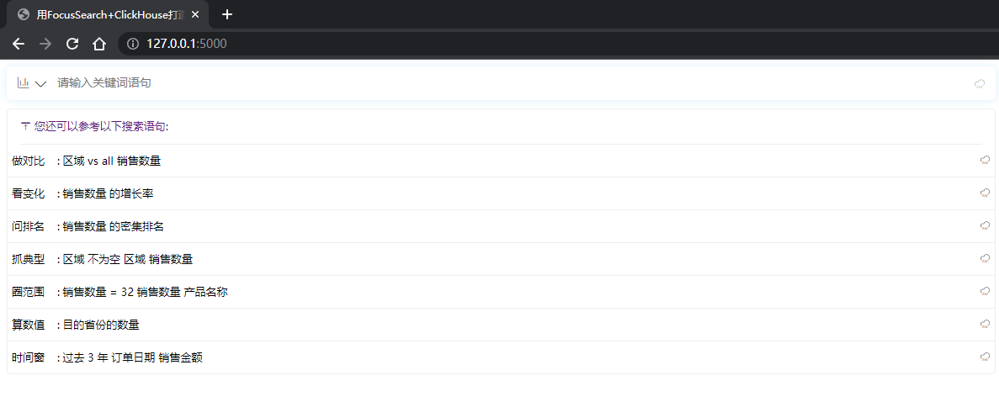

点击左侧下标可展开当前加载的模型信息。这里的模型信息就是前面registerModel里填写的tables等信息。在搜索框里可直接使用Datafocus的关键词进行搜索查询。

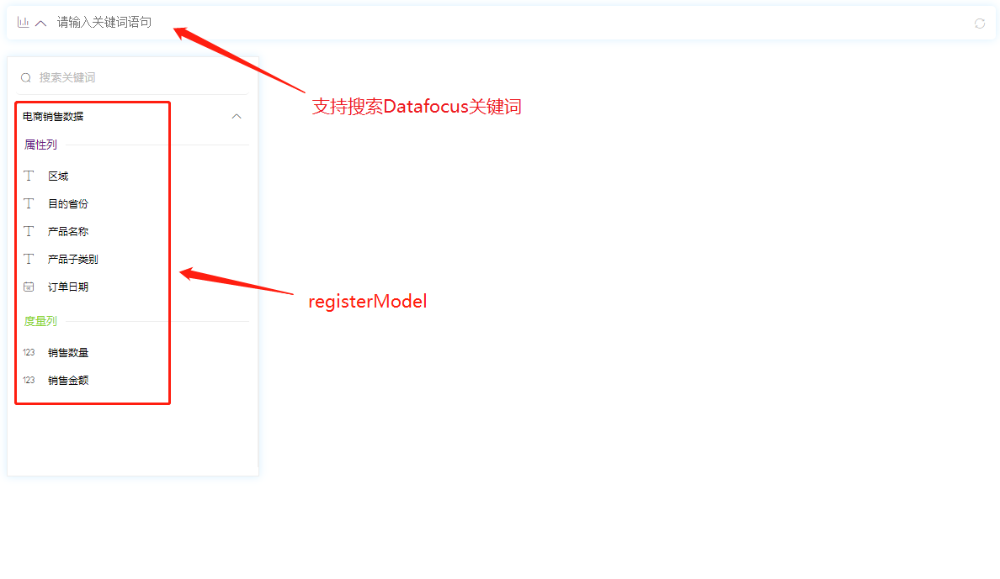

修改platform参数为mobile可将搜索框切换为移动端样式，移动端支持语音输入。

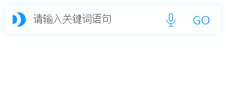


#### 6.使用SQL查询数据

到此为止，我们已经可以输入自然语言获取SQL语句了。接下来结合具体的使用场景，可以做一些应用。比如，直接用SQL语句到clickhouse库中查询出结果并返回出来。这里我们需要增加一点前后端代码。

##### 增加一个后端接口可查询Clickhouse

在demo.py文件中添加一个接口

```python
import clickhouse_connect
@app.route('/query', methods=["POST"])
def query():
    sql = request.json.get("sql")
    driver = clickhouse_connect.get_client(host="192.168.0.**", port=9000, database="default", username="default", password="********")
    res = driver.query(sql)
    return {"result": res.result_rows}
```


##### 前端接收查询结果并显示到页面上

在<body>添加显示查询结果的<table>元素

```html
<body>
    <div id="search-sql-container"></div>
    <p id="sql" style="font-size: 18px"></p>
    <table id="result" style="font-size: 18px;" border="1" cellspacing="1" cellpadding="5"></table>
</body>
```

在获取sql的请求的回调函数中添加query请求逻辑

```js
......
let xhr = new XMLHttpRequest();
xhr.open("POST", "/query", true);
xhr.setRequestHeader("Content-type", "application/json");
xhr.onreadystatechange = function () {
    let XMLHttpReq = xhr;
    if (XMLHttpReq.readyState == 4 && XMLHttpReq.status == 200) {
        let response = JSON.parse(XMLHttpReq.responseText);
        console.log(response);
        let result = response.result
        let html = ""
        for(let i=0;i<result.length;i++){
            html+="<tr>"
            for(let j=0;j<result[i].length;j++){
                html+="<td>"+result[i][j]+"</td>";
            }
            html+="</tr>"
        }
        document.getElementById("result").innerHTML=html;
    }
}
xhr.send(JSON.stringify({"sql": response.data.sql}));
......
```

此时我们重启一下flask，再刷新页面。到此我们就完成了FocusSearch+Clickhouse的快速集成，从自然语言搜索到返回sql，再到查询数据返回结果，可以快速的集成进自己的业务系统中。具体使用过程见下文


## 使用示例

直接搜索一个“销售数量的月增长率”，可以生成对应的clickhouse方言的sql语句，加上clickhouse查询的业务逻辑后，生成出的sql可以直接查询回结果。（注：连接的ClickHouse中需要有registerModel中对应数据表）


成功查询出销售数量的月增长率。生成的sql如下

```sql
select
  col_13495330251365580557 as col_13822001878759813828,
(
    case
      (col_9930400185996611067)
      when 0 then 0.0
      else (
        (
          (
            col_12893938725546020756 - col_9930400185996611067
          )
        ) /(col_9930400185996611067)
      )
    end
  ) as col_12182153527267677264
from
  (
    select
      toDateTime(
        toStartOfMonth(CAST(tbl_1679024562588127241.`订单日期` as DateTime))
      ) as col_13495330251365580557,
      sum(tbl_1679024562588127241.`销售数量`) as col_12893938725546020756
    from
      `电商销售数据` tbl_1679024562588127241
    group by
      toDateTime(
        toStartOfMonth(CAST(tbl_1679024562588127241.`订单日期` as DateTime))
      )
  ) tbl_1
  LEFT JOIN (
    select
      sum(tbl_1679024562588127241.`销售数量`) as col_9930400185996611067,
      addMonths(
        toDateTime(
          toStartOfMonth(CAST(tbl_1679024562588127241.`订单日期` as DateTime))
        ),
        1
      ) as col_10328216712068187855
    from
      `电商销售数据` tbl_1679024562588127241
    group by
      addMonths(
        toDateTime(
          toStartOfMonth(CAST(tbl_1679024562588127241.`订单日期` as DateTime))
        ),
        1
      )
  ) tbl_3 on col_13495330251365580557 = col_10328216712068187855
order by
  col_13495330251365580557;
```


再试一试其他的搜索语句，搜索定基增长率。


VS对比语句

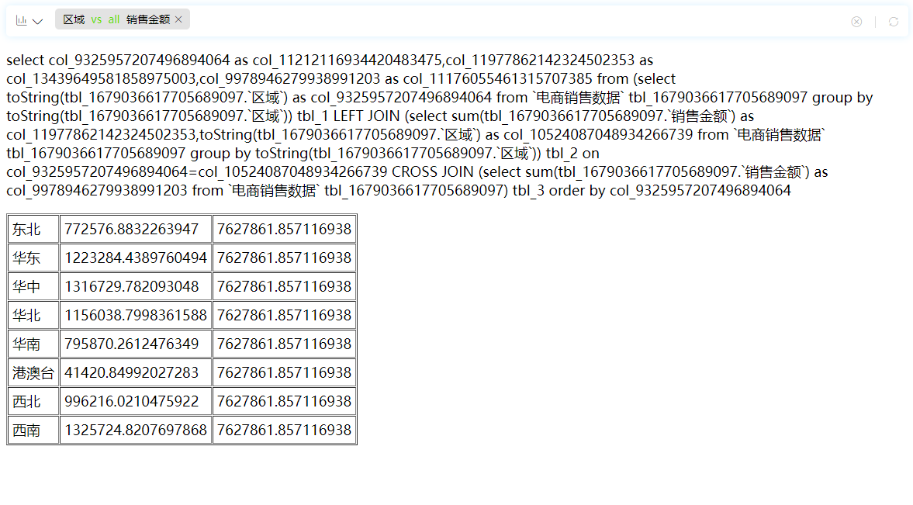


时间范围筛选与聚合语句

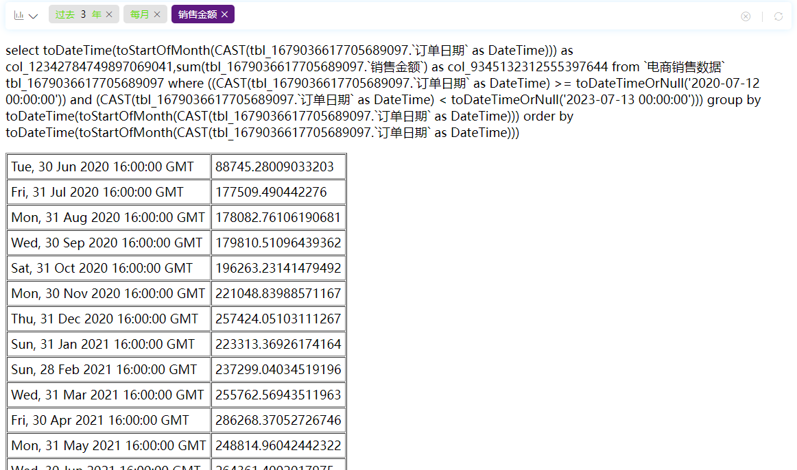


非空筛选语句

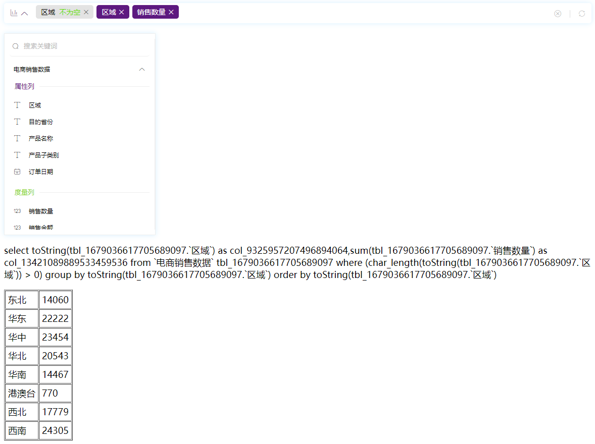


## 响应速度测试

现在是能实现集成的效果，但是请求之间来回请求，请求之间的时间消耗情况怎么样呢？
集成过程中请求的流程相当于有三段，依次分别是：①长连接解析语句返回identity ②请求/sql接口换回sql内容 ③请求/query接口去clickhouse查询结果。

增加一点日志，把上文使用示例中的语句的解析过程记录下请求时间，分别解析三次后取耗时均值，响应速度如下表：

| 解析语句                                 | SQL解析耗时(ms) | 获取SQL(ms) | ClickHouse查询(ms) | 总耗时(ms) |
| ---------------------------------------- | --------------- | ----------- | ------------------ | ---------- |
| 销售数量的月增长率                       | 331             | 173         | 54                 | 558        |
| 销售数量的定基增长率 相对于2021年7月12日 | 442             | 168         | 64                 | 674        |
| 区域 vs all 销售金额                     | 318             | 169         | 58                 | 545        |
| 过去 3 年 每月 销售金额                  | 339             | 167         | 43                 | 549        |
| 区域 不为空 区域 销售数量                | 468             | 168         | 31                 | 667        |

可以看出语句解析的速度还是非常快的，在半秒内就可以完成，即使加上后面的查询数据等业务逻辑，总体耗时也就半秒多一点。值得一提的是，/query接口中使用的本地Clickhouse查询非常迅速，仅50左右毫秒就可以完成查询。


## 小结

通过引入FocusSearch作为自然语言转SQL的解析引擎，并与Clickhouse数据库集成，我们成功实现了一种方便、高效且用户友好的数据分析和查询工具。使用起来非常便捷，仅需在前端引入对应的组件，就可在自己的业务场景中实现一个搜索分析框。结合显示的业务需求，FocusSearch可以结合进入更加复杂的分析场景。

FocusSearch SQL的功能是自然语言转SQL的解析，结合DFC应用，FocusSearch还支持强大的绘制数据图形的功能，这使BI数据分析嵌入自身业务变得触手可及。感兴趣的小伙伴可以@我继续出支持绘图版本FocusSearch的教程。